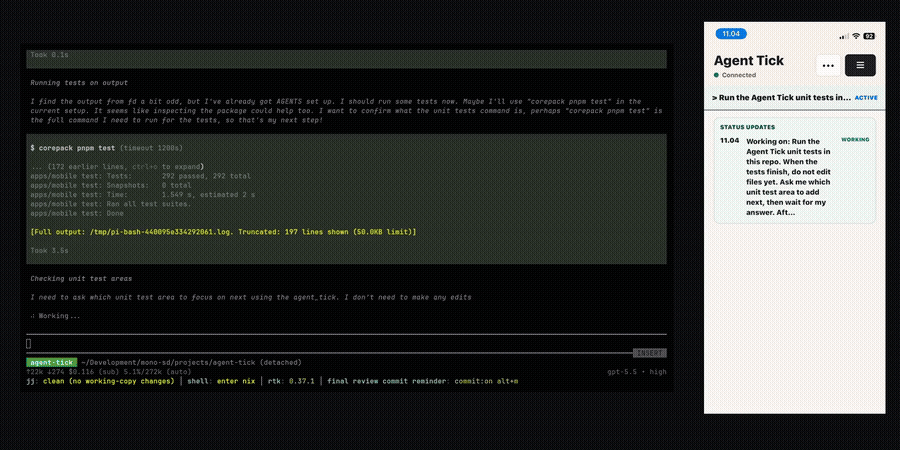

# Agent Tick

<p align="center">
  
</p>

**Let coding agents ask before they do sensitive work.**

Agent Tick mirrors bounded requests from local coding agents to trusted humans. Agents can send **Status Updates**, ask **Steering** questions, and request **Sanctions** before risky actions — without turning the Native App, hosted service, or Personal Console into a remote shell.

<p align="center">
  <a href="https://agenttick.sh"><b>Website</b></a> ·
  <a href="https://app.agenttick.sh"><b>Hosted app</b></a> ·
  <a href="https://docs.agenttick.sh"><b>Docs</b></a> ·
  <a href="./SELFHOSTING.md"><b>Self-hosting</b></a>
</p>

## Why Agent Tick?

Coding agents are most useful when they can keep working independently, but they still need crisp human input at the right moments.

Agent Tick gives them a least-permission request layer:

- **Status Updates** — lightweight progress notes from local agent sessions.
- **Steering** — bounded questions with structured choices when the agent needs direction.
- **Sanctions** — explicit approval before sensitive commands, deploys, migrations, or policy-relevant work.

The agent asks once. The same request can appear in the local agent interface and in the Agent Tick Native App. The first trusted answer resolves the request everywhere, then local work continues.

## Get started

Most users should start with the hosted service at <https://app.agenttick.sh>.

For guided setup, paste this into your coding agent chat on the machine you want to configure:

```text
Fetch and follow the Agent Tick setup skill from:
https://agenttick.sh/skill.md

Use that skill to set up Agent Tick on this machine. Ask me which coding agent I am using and what kind of work I want routed Requests for. Walk me through enabling status updates, steering, and sanctions, and let me opt out of any of the three. Use the right integration for this agent, run a dry run first, explain what will change, then install after I confirm and verify it works.
```

Prefer to install the CLI yourself?

```sh
npm install -g @self-deprecated/agent-tick
agent-tick install
```

The installer signs this machine into Agent Tick, stores a local `agent_...` token, detects local coding-agent configs, and installs supported integrations where available.

Launch integrations include Claude Code and Codex through MCP, optional Claude Code permission hooks, and Pi through the native extension. Other agent configs may be detected as disabled scaffolds until their hook/config behavior is verified.

## Self-hosting

Agent Tick is source-available and self-hostable for teams that need to operate request routing on their own infrastructure. Self-hosting is not the default onboarding path; start with [SELFHOSTING.md](./SELFHOSTING.md) if you need it.

## Development and docs

- [docs/index.md](./docs/index.md) — public documentation source for docs.agenttick.sh
- [docs/quick-start.md](./docs/quick-start.md) — connect a machine and send safe test requests
- [docs/integrations.md](./docs/integrations.md) — integration setup guides
- [DEVELOPMENT.md](./DEVELOPMENT.md) — local development workflow
- [CONTRIBUTING.md](./CONTRIBUTING.md) — contribution and public mirror policy

## License

Agent Tick is source-available under the [Business Source License 1.1](./LICENSE) (BSL 1.1). You may use, modify, and self-host it internally — including for commercial purposes — but you may not offer Agent Tick as a hosted or managed service to third parties. The license converts to Apache 2.0 on 2028-05-31.
