# Entitlement lifecycle

Agent Tick has two related entitlement tracks:

1. **Native App access** — whether the first-party mobile app can submit responses.
2. **Hosted personal service** — whether agenttick.sh hosted routing, push, updates, uptime, and recent hosted history are active.

Self-hosted servers remain under the operator's control. Agent Tick entitlements only decide whether the first-party app and hosted personal service accept new routing/response activity; they do not turn the phone or hosted service into a remote shell.

## State diagram

```mermaid
stateDiagram-v2
  [*] --> TrialActive: first app open
  TrialActive: 7-day Trial
  TrialActive: app responses enabled
  TrialActive: hosted personal active
  TrialActive --> TrialReadOnly: Trial ends without Lifetime app unlock
  TrialActive --> LifetimeUnlocked: Lifetime app unlock purchased/restored

  TrialReadOnly: Read-only after Trial
  TrialReadOnly: viewing/settings/purchase/restore stay available
  TrialReadOnly: responses disabled
  TrialReadOnly --> LifetimeUnlocked: purchase or restore Lifetime unlock

  LifetimeUnlocked: Lifetime app unlock active
  LifetimeUnlocked: self-hosted app responses enabled forever
  LifetimeUnlocked: hosted personal optional
  LifetimeUnlocked --> IncludedHostedMonth: activate included hosted month
  LifetimeUnlocked --> HostedSubscriptionActive: subscribe monthly/yearly

  IncludedHostedMonth: Included hosted month active
  IncludedHostedMonth: 31 days after hosted activation
  IncludedHostedMonth: hosted routing/push/responses enabled
  IncludedHostedMonth --> HostedExpired: included hosted month ends without subscription
  IncludedHostedMonth --> HostedSubscriptionActive: subscribe monthly/yearly

  HostedSubscriptionActive: Hosted subscription active
  HostedSubscriptionActive: hosted routing/push/responses enabled
  HostedSubscriptionActive --> ReadOnlyRoutingGrace: subscription canceled/lapsed

  ReadOnlyRoutingGrace: Read-Only Routing Grace
  ReadOnlyRoutingGrace: 30 days after subscription end when canceled
  ReadOnlyRoutingGrace: routing/history visible; responses and push disabled
  ReadOnlyRoutingGrace --> HostedSubscriptionActive: renew subscription
  ReadOnlyRoutingGrace --> HostedExpired: grace ends

  HostedExpired: Hosted personal expired
  HostedExpired: hosted routing/responses/push disabled
  HostedExpired --> HostedSubscriptionActive: subscribe again
```

## Launch state table

| State | Entry condition | App responses | Hosted routing | Push | History/visibility | Exit |
| --- | --- | --- | --- | --- | --- | --- |
| Trial active | First open starts the 7-day local Trial | Enabled | Enabled for hosted personal context | Enabled for hosted personal context | Normal launch history behavior | Trial ends, or Lifetime app unlock is purchased/restored |
| Read-only after Trial | Trial ended and no Lifetime app unlock exists | Disabled | Hosted personal also inactive unless another hosted entitlement exists | Disabled for hosted personal | Viewing, settings, purchase, and restore stay available | Purchase or restore Lifetime app unlock |
| Lifetime unlock active | One-time app-store purchase is recorded/restored | Enabled for self-hosted servers and active hosted contexts | Not included forever; hosted personal needs Trial, included month, or subscription | Not included forever | Self-hosted app use remains unlocked on the app-store account | Activate included hosted month or subscribe |
| Included hosted month active | Lifetime unlock exists and hosted personal service is activated for the included month | Enabled | Enabled | Enabled | Normal launch history behavior | Included month ends or user subscribes |
| Hosted subscription active | Monthly/yearly hosted personal subscription is active | Enabled | Enabled | Enabled | Normal launch history behavior | Subscription lapses/cancels |
| Read-Only Routing Grace | Hosted subscription ended after cancellation and grace has not expired | Disabled for hosted personal requests | Enabled so recent hosted context can still be viewed/recovered | Disabled | Recent hosted personal history remains visible during the grace period | Renew, delete hosted data, or grace expires |
| Hosted expired | No Trial, included month, active subscription, or grace applies | Disabled for hosted personal requests | Disabled | Disabled | Hosted personal retention drops to zero in current lifecycle status | Subscribe again or switch to self-hosted use |
| Hosted data deleted | User deletes hosted personal data | Disabled | Disabled | Disabled | Hosted personal history retention is zero; safe hosted data is deleted/revoked | New hosted setup if supported later |

## Product rules

- The **7-day Trial** starts on first app open and does not require sign-in.
- Trial includes hosted and self-hosted app use.
- **Lifetime app unlock** is a one-time app-store purchase for ongoing first-party app use with self-hosted servers after Trial.
- Lifetime app unlock **does not include hosted service forever**.
- The **included hosted month** starts only when hosted personal service is first activated after Lifetime unlock; it does not run during the initial Trial.
- Hosted personal service can continue after the included month through optional monthly or yearly app-store subscriptions.
- **Read-Only Routing Grace** is a hosted personal recovery state after a canceled/lapsed subscription: routing and recent history remain available, but responses and push are disabled.
- Self-hosted deployments are responsible for their own uptime, backups, notifications, and data retention.

## Implementation anchors

- Mobile app Trial/Lifetime/included-month state: `apps/mobile/AppLogic.ts`
- Mobile entitlement status copy: `docs/mobile-app.md`
- Hosted personal lifecycle and read-only grace: `apps/server/src/services/personalEntitlements.ts`
- Hosted personal billing events: `apps/server/src/routes/billing.ts`
- Public pricing copy: `agenttick.sh/src/routes/pricing/+page.svelte`
- Legal/privacy disclosure inputs: `docs/hosted-data-inventory.md` and `docs/deletion-controls-verification.md`

## Copy boundaries

Use this wording when updating public copy:

- Good: “Agent Tick routes bounded approval requests and responses.”
- Good: “After Trial, Lifetime app unlock keeps first-party app use available with self-hosted servers.”
- Good: “Hosted personal service requires Trial, included hosted month, or an active subscription.”
- Avoid: “The app purchase includes hosted service forever.”
- Avoid: “The phone runs commands remotely.”
- Avoid: “Read-only grace preserves all data indefinitely.”
